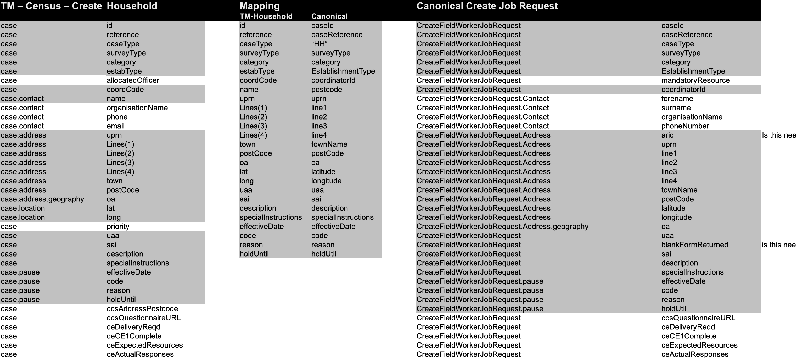
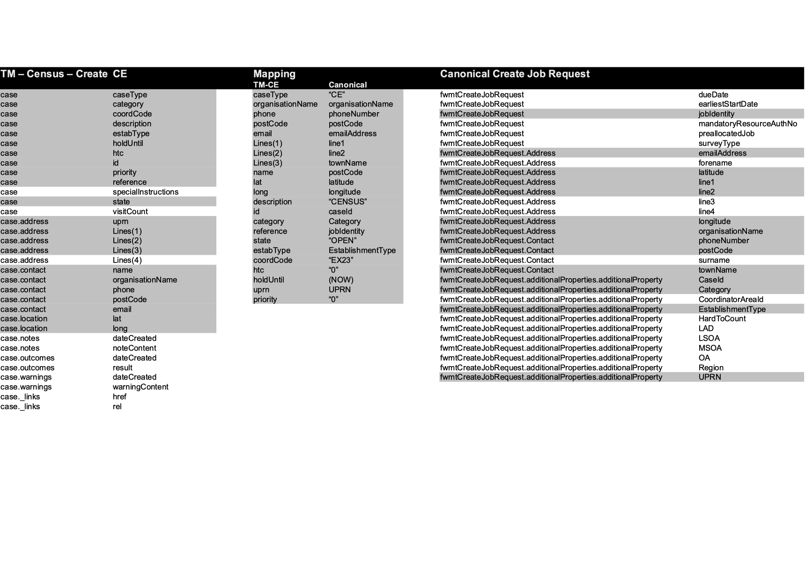
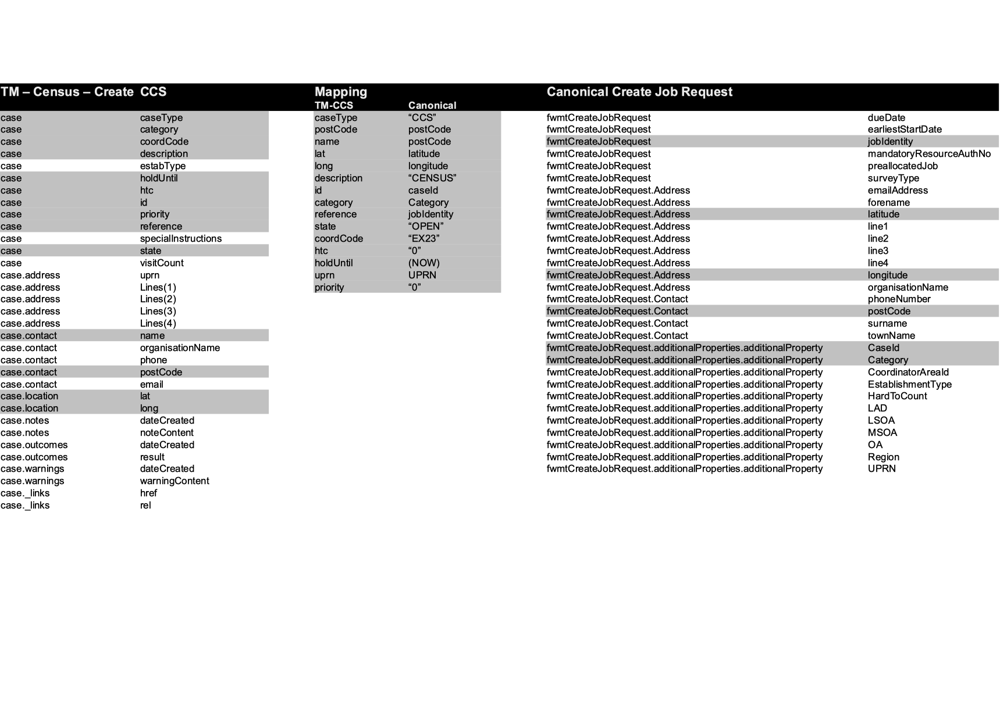

  

# fwmt-job-service-v2
Service to create and reallocate jobs to users for RM

## Running
    ./gradlew bootRun

## Copyright
Copyright (C) 2018 Crown Copyright (Office for National Statistics)

# tm-canonical-hh
 
	

# tm-canonical-ce

	

# tm-canonical-ccs

	
 
